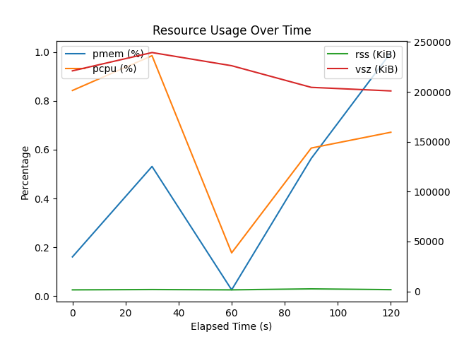

# [YET UNNAMED] Resource Usage Plotter

This script reads resource usage data from a newline-delimited JSON (NDJSON) file and plots the memory and CPU usage over time using Matplotlib.

## Usage

To run the script, use the following command:

```sh
./poc.py EXAMPLE_usage.json
```

### Output

The script will generate a plot showing the memory and CPU usage over time and display on the screen.



## Dependencies

Make sure you have the following Python libraries installed:

```sh
pip install matplotlib numpy
```
